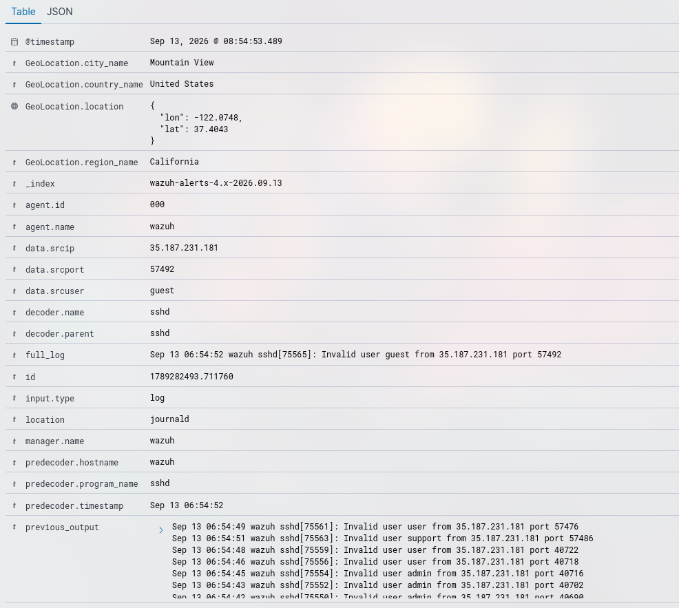

# Incidente 001 sshd brute force

## Resumen
- **Fecha/hora:** 2026-09-13 08:54 (UTC+2)
- **Regla(s) que saltó:** sshd: brute force trying to get access to the system. Non existent user. (5712)
- **Técnica MITRE ATT&CK:** T1110 - Brute Force
- **Endpoint afectado:** Wazuh Manager
- **Severidad:** Baja
- **Veredicto:** Benigno

## 1. Ejecución del ataque
Este ataque fue realizado por una serie de bots que realizan ataques de fuerza bruta a los puertos abiertos. En concreto al puerto SSH del Wazuh Manager (puesto que este está conectado a internet)

## 2. Evidencia recolectada
- Captura del evento en Wazuh 
- IP origen: 35.187.231.181
- Usuario/Proceso: guest -> sshd
- Línea de comando completa: `Sep 13 06:54:52 wazuh sshd[75565]: Invalid user guest from 35.187.231.181 port 57492`
- Eventos correlacionados: rule.id:5710 y rule.id:5712 y data.srcip:35.187.231.181

## 3. Investigación (paso a paso)
1. Revisando los logs me encontré que el servidor de Wazuh había sido víctima de un ataque de fuerza bruta externo, común en servicios con puertos abiertos a internet.
2. Posteriormente me puse a investigar que más había hecho el atacante con `data.srcip:35.187.231.181`
3. Comprobé que solo había realizado ataques de fuerza bruta al servicio sshd, y además ninguno era del usuario principal `data.srcuser:ubuntu`. Por lo que no se produjo ningún inicio de sesión exitoso.
4. Además observé el uso de puertos altos y aleatorios por lo que deduje que se trataría de un escáner automático. 

## 4. Análisis
Puesto que se trata de ruido al tener expuesto un puerto a Internet, el acceso por ssh con el usuario principal se permite solo mediante un par de claves público-privada y no se ha intentado acceder al usuario principal, establezco la severidad en baja.

## 5. Acciones de respuesta
Recomendaría seguir monitorizando y en caso de que se repita de nuevo, bloquearía IP o cerraría el puerto 22 a Internet y permitiría acceso solo a través de la VPN interna.

## 6. Recomendaciones de mejora (detection engineering)
Recomendaría crear una regla Active Response para bloquear automáticamente a nivel de firewall IPs que hagan un ataque de fuerza bruta.

## 7. Lecciones aprendidas
He aprendido que hoy en día tener un puerto abierto a Internet es una gran superficie de ataque puesto que hay bots automáticos que intentarán realizarte ataques de fuerza bruta a todas horas.
