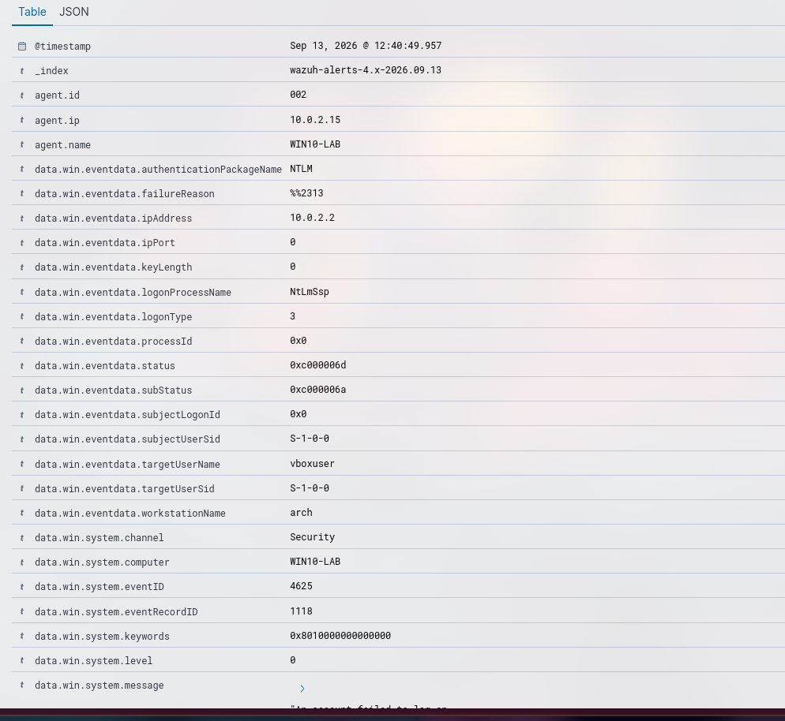

# Incidente 002: Multiple Windows Logon Failures

## Resumen
- **Fecha/hora:** 2026-09-13 12:40 (UTC+2)
- **Regla(s) que saltó:** Multiple Windows Logon Failures (60204)
- **Técnica MITRE ATT&CK:** T1110 - Brute Force
- **Endpoint afectado:** WIN10-LAB
- **Severidad:** Media
- **Veredicto:** Verdadero positivo

## 1. Ejecución del ataque
Se atacó al endpoint de Windows 10 desde el host de la VM (se utilizó port forwarding, por eso el 127.0.0.1) mediante un ataque de fuerza bruta con diccionario:
```bash
hydra -l vboxuser -P rockyou.txt rdp://127.0.0.1 -s 13389 -t 4 -V
```


## 2. Evidencia recolectada
- Captura del evento en Wazuh

- IP origen: [10.0.2.2]
- Usuario/Proceso: vboxuser -> RDP
- Línea de comando completa: 
```
An account failed to log on.

Subject:
	Security ID:		S-1-0-0
	Account Name:		-
	Account Domain:		-
	Logon ID:		0x0

Logon Type:			3

Account For Which Logon Failed:
	Security ID:		S-1-0-0
	Account Name:		vboxuser
	Account Domain:		

Failure Information:
	Failure Reason:		Unknown user name or bad password.
	Status:			0xC000006D
	Sub Status:		0xC000006A


Process Information:
	Caller Process ID:	0x0
	Caller Process Name:	-

Network Information:
	Workstation Name:	arch
	Source Network Address:	10.0.2.2
	Source Port:		0

Detailed Authentication Information:
	Logon Process:		NtLmSsp 
	Authentication Package:	NTLM
	Transited Services:	-
	Package Name (NTLM only):	-
	Key Length:		0
```
- Eventos correlacionados: `rule.id:60122` y `rule.id:60204`

## 3. Investigación (paso a paso)
1. Se detectó un ataque de fuerza bruta al usuario principal de la máquina virtual al servicio RDP.
2. Comprobé que el atacante no había intentado atacar ningún otro servicio mirando `data.win.eventdata.ipAddress:10.0.2.2`
3. El valor `data.win.eventdata.subStatus:0xc000006a` implica que el usuario fue correcto pero la contraseña no.
4. No se produjo ningún acceso exitoso `data.win.system.eventID:4624`

## 4. Análisis
Puesto que es un ataque específico hacia nuestro sistema al usar un usuario válido, otorgo una severidad media, siendo necesario realizar una respuesta para mitigar un posible acceso futuro. 

Tras aplicar las acciones de respuesta permancería monitorizando por si se repitiesen futuros ataques.

## 5. Acciones de respuesta
- Escalar a N2 al tratarse de un ataque dirigido.
- Establecer políticas de contraseñas robustas.
- Eliminar el acceso a RDP a través de Internet y obligar al uso de una VPN.
- Recomendado establecer una política de _lockout_ a partir de una serie de intentos fallidos. Sin embargo el atacante podría realizar un ataque de denegación de servicio, impidiendo al usuario legítimo acceder.
- Cambiar el nombre de usuario.
- Obligar al uso de MFA para el acceso a RDP.

## 6. Recomendaciones de mejora (detection engineering)
Crearía una Active Response para bloquear automáticamente IPs que intenten hacer fuerza bruta, pese a eliminar el acceso a RDP a través de Internet.

## 7. Lecciones aprendidas
Aprendí que es importante establecer políticas Zero Trust donde el usuario debe autenticarse previamente utilizando una conexión segura como puede ser una VPN para posteriormente acceder a un servicio como puede ser RDP. También el uso de MFA mitiga drásticamente la probabilidades de éxito de un ataque de fuerza bruta.
