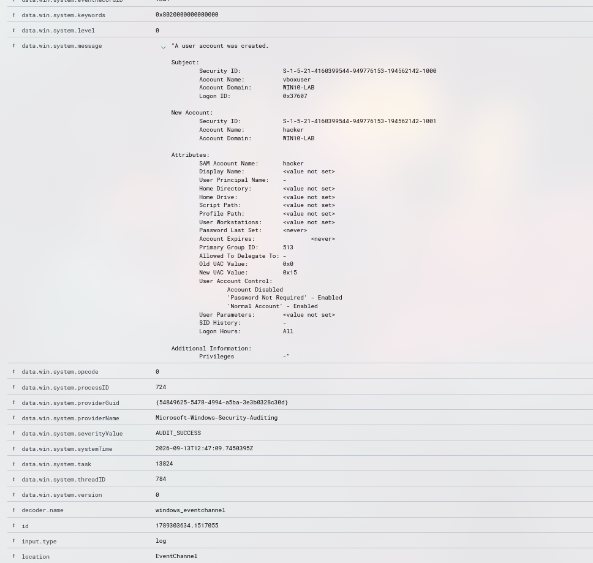

# Incidente 002: User account enabled or created + Administrators Group Changed

## Resumen
- **Fecha/hora:** 2026-09-13 14:47 (UTC+2)
- **Regla(s) que saltó:** User account enabled or created (60109)
- **Técnica MITRE ATT&CK:** T1098 - Account Manipulation, T1484 - Domain Policy Modification
- **Endpoint afectado:** WIN10-LAB
- **Severidad:** Crítica
- **Veredicto:** Verdadero positivo

## 1. Ejecución del ataque
Se creó una cuenta de usuario y posteriormente se escaló para que fuese administrador.
```powershell
net user hacker P@ssw0rd123! /add
net localgroup Administrators hacker /add 
```

## 2. Evidencia recolectada
- Captura del evento en Wazuh

- Registro de creación de usuario: 
```
A user account was created.

Subject:
	Security ID:		S-1-5-21-4160399544-949776153-194562142-1000
	Account Name:		vboxuser
	Account Domain:		WIN10-LAB
	Logon ID:		0x37607

New Account:
	Security ID:		S-1-5-21-4160399544-949776153-194562142-1001
	Account Name:		hacker
	Account Domain:		WIN10-LAB

Attributes:
	SAM Account Name:	hacker
	Display Name:		<value not set>
	User Principal Name:	-
	Home Directory:		<value not set>
	Home Drive:		<value not set>
	Script Path:		<value not set>
	Profile Path:		<value not set>
	User Workstations:	<value not set>
	Password Last Set:	<never>
	Account Expires:		<never>
	Primary Group ID:	513
	Allowed To Delegate To:	-
	Old UAC Value:		0x0
	New UAC Value:		0x15
	User Account Control:	
		Account Disabled
		'Password Not Required' - Enabled
		'Normal Account' - Enabled
	User Parameters:	<value not set>
	SID History:		-
	Logon Hours:		All

Additional Information:
	Privileges		-

```
- Registro de escalada de privilegio:
```
"A member was added to a security-enabled local group.

Subject:
	Security ID:		S-1-5-21-4160399544-949776153-194562142-1000
	Account Name:		vboxuser
	Account Domain:		WIN10-LAB
	Logon ID:		0x37607

Member:
	Security ID:		S-1-5-21-4160399544-949776153-194562142-1001
	Account Name:		-

Group:
	Security ID:		S-1-5-32-544
	Group Name:		Administrators
	Group Domain:		Builtin

Additional Information:
	Privileges:		-"
```

- Eventos correlacionados: `data.win.system.eventID:4720`, `data.win.system.eventID:4732`, `rule.id:60109`, `rule.id:60154`

## 3. Investigación (paso a paso)
1. Observé que un nuevo usuario llamado `hacker` fue creado y añadido al grupo de usuarios.
2. Tras unos minutos, un nuevo registro apareció en el cual el usuario había escalado privilegios y ahora tenía permisos de administrador.
3. No se observaron nuevos usuarios creados.
4. No se observa un inicio de sesión remoto, posible malware?
5. Se observó que la escalada de privilegio se produzco mediante powershell a las 14:50 (UTC+2) (`data.win.system.eventID:1`):
```
Process Create:
RuleName: technique_id=T1018,technique_name=Remote System Discovery
UtcTime: 2026-09-13 13:25:00.902
ProcessGuid: {e65a69a6-a42c-6aa6-c301-000000000600}
ProcessId: 2492
Image: C:\Windows\System32\net.exe
FileVersion: 10.0.19041.1 (WinBuild.160101.0800)
Description: Net Command
Product: Microsoft® Windows® Operating System
Company: Microsoft Corporation
OriginalFileName: net.exe
CommandLine: "C:\Windows\system32\net.exe" localgroup Administrators hacker /add
CurrentDirectory: C:\Windows\system32\
User: WIN10-LAB\vboxuser
LogonGuid: {e65a69a6-9a98-6aa6-0776-030000000000}
LogonId: 0x37607
TerminalSessionId: 1
IntegrityLevel: High
Hashes: SHA1=88B101598CC6726B7A57D02B1FA95BE1B272A821,MD5=0BD94A338EEA5A4E1F2830AE326E6D19,SHA256=9F376759BCBCD705F726460FC4A7E2B07F310F52BAA73CAAAAA124FDDBDF993E,IMPHASH=57F0C47AE2A1A2C06C8B987372AB0B07
ParentProcessGuid: {e65a69a6-a40b-6aa6-c101-000000000600}
ParentProcessId: 6208
ParentImage: C:\Windows\System32\WindowsPowerShell\v1.0\powershell.exe
ParentCommandLine: "C:\Windows\System32\WindowsPowerShell\v1.0\powershell.exe" 
ParentUser: WIN10-LAB\vboxuser"
```

5. No se crearon servicios nuevos `data.win.system.eventID:7045`.
6. Se confirma que no coincide con ninguna ventana de mantenimiento, ni ningún despliegue de software nuevo.

## 4. Análisis
Debido al potencial peligro que supone estas acciones ya que un atacante ha sido capaz de escalar privilegios, clasifico la situación como crítica, escalo y tomo acciones inmediatamente. 

## 5. Acciones de respuesta
- Escalada a N2 como urgente.
- Cuenta creada deshabilitada
- Aislamiento de host
- Se requiere investigación forense y búsqueda de persistencia

## 6. Recomendaciones de mejora (detection engineering)
Como la escalada se produjo mediante powershell puesto que la cuenta vboxuser tiene permisos de administrador, recomiendo que la cuenta de uso diaria no tenga permisos de administrador (_Principle of least privilege_)

## 7. Lecciones aprendidas
Aprendí el riesgo que supone una escalada de privilegios, lo importante que es llegar a tiempo antes de que el atacante realice movimientos laterales y así poder contener la amenaza. He aprendido que es importante no apagar el host cuando ocurre esto puesto que se destruiría información forense irrecuperable. También es importante analizar como entró el atacante y cómo realizó la escalada para establecer las medidas de seguridad adecuadas para que no vuelva a pasar. Y que es importante aplicar el principio de menor privilegio para así reducir las superficies de ataque.

