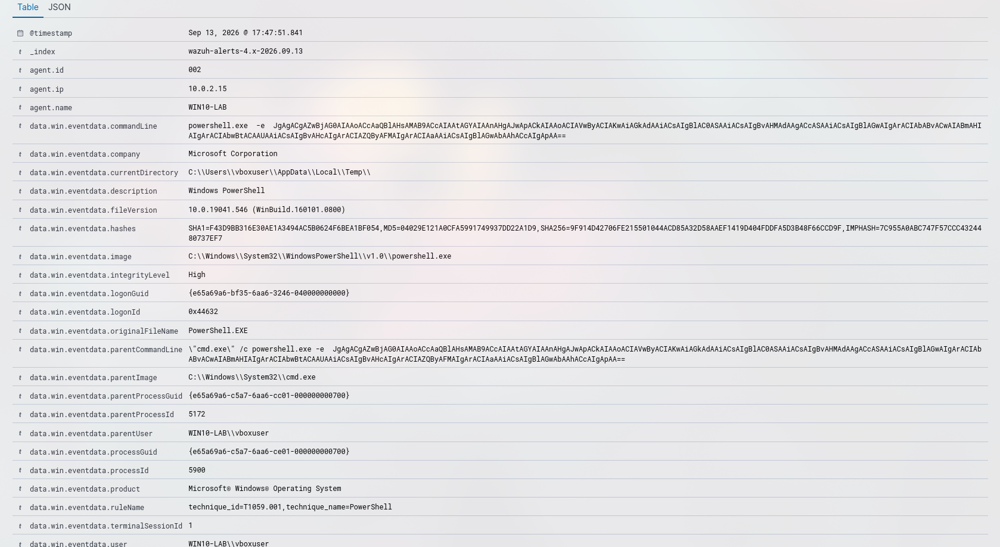

# Incident 004: Suspicious Windows cmd shell execution

## Summary
- **Date/time:** 2026-09-13 17:47 (UTC+2)
- **Triggered rule(s):** Suspicious Windows cmd shell execution (92032)
- **MITRE ATT&CK technique:** T1059.003 - Windows Command Shell
- **Affected endpoint:** WIN10-LAB
- **Severity:** High
- **Verdict:** True positive

## 1. Attack execution
An Atomic Red Team test (PowerShell Command Execution) was executed
```powershell
Invoke-AtomicTest T1059.001 -TestNumber 17
```


## 2. Evidence collected
- Screenshot of the event in Wazuh

- User/Process: vboxuser → powershell.exe
- Full command line:
```
"Process Create:
RuleName: technique_id=T1059.001,technique_name=PowerShell
UtcTime: 2026-09-13 15:47:51.504
ProcessGuid: {e65a69a6-c5a7-6aa6-ce01-000000000700}
ProcessId: 5900
Image: C:\Windows\System32\WindowsPowerShell\v1.0\powershell.exe
FileVersion: 10.0.19041.546 (WinBuild.160101.0800)
Description: Windows PowerShell
Product: Microsoft® Windows® Operating System
Company: Microsoft Corporation
OriginalFileName: PowerShell.EXE
CommandLine: powershell.exe  -e  JgAgACgAZwBjAG0AIAAoACcAaQBlAHsAMAB9ACcAIAAtAGYAIAAnAHgAJwApACkAIAAoACIAVwByACIAKwAiAGkAdAAiACsAIgBlAC0ASAAiACsAIgBvAHMAdAAgACcASAAiACsAIgBlAGwAIgArACIAbABvACwAIABmAHIAIgArACIAbwBtACAAUAAiACsAIgBvAHcAIgArACIAZQByAFMAIgArACIAaAAiACsAIgBlAGwAbAAhACcAIgApAA==
CurrentDirectory: C:\Users\vboxuser\AppData\Local\Temp\
User: WIN10-LAB\vboxuser
LogonGuid: {e65a69a6-bf35-6aa6-3246-040000000000}
LogonId: 0x44632
TerminalSessionId: 1
IntegrityLevel: High
Hashes: SHA1=F43D9BB316E30AE1A3494AC5B0624F6BEA1BF054,MD5=04029E121A0CFA5991749937DD22A1D9,SHA256=9F914D42706FE215501044ACD85A32D58AAEF1419D404FDDFA5D3B48F66CCD9F,IMPHASH=7C955A0ABC747F57CCC4324480737EF7
ParentProcessGuid: {e65a69a6-c5a7-6aa6-cc01-000000000700}
ParentProcessId: 5172
ParentImage: C:\Windows\System32\cmd.exe
ParentCommandLine: "cmd.exe" /c powershell.exe -e  JgAgACgAZwBjAG0AIAAoACcAaQBlAHsAMAB9ACcAIAAtAGYAIAAnAHgAJwApACkAIAAoACIAVwByACIAKwAiAGkAdAAiACsAIgBlAC0ASAAiACsAIgBvAHMAdAAgACcASAAiACsAIgBlAGwAIgArACIAbABvACwAIABmAHIAIgArACIAbwBtACAAUAAiACsAIgBvAHcAIgArACIAZQByAFMAIgArACIAaAAiACsAIgBlAGwAbAAhACcAIgApAA==
ParentUser: WIN10-LAB\vboxuser"
```

## 3. Investigation (step by step)
1. Detection of a base64-obfuscated PowerShell script executed from the Temp folder
2. cmd -> PowerShell process chain with elevated privileges
3. It is observed that during the execution of the script, the same process (Guid: `{e65a69a6-c5a7-6aa6-ce01-000000000700}`) created the temporary file _PSScriptPolicyTest.ps1, a benign artifact from PowerShell's internal policy check (AppLocker/WDAC). It was correlated by ProcessGuid, ruling out a second attack vector.
4. No additional anomalous behavior could be observed.
5. The script was successfully deobfuscated manually.

## 4. Analysis
Due to the large number of suspicious indicators (base64 script, temporary folder and elevated privileges), I classify this alert as high severity because of the imminent risk it poses.

## 5. Response actions
- Escalation to L2
- Machine isolation
- Perform forensic analysis of the script

## 6. Improvement recommendations (detection engineering)
It is recommended to remove administrator permissions from non-essential accounts. Applying the _Least privilege_ principle

## 7. Lessons learned
I have learned how important the _Least privilege_ principle is since an attacker could easily execute a script with administrator permissions without the user being aware of it.

## 8. References
- MITRE ATT&CK: https://attack.mitre.org/techniques/TXXXX/
- [Documentation/articles consulted]
