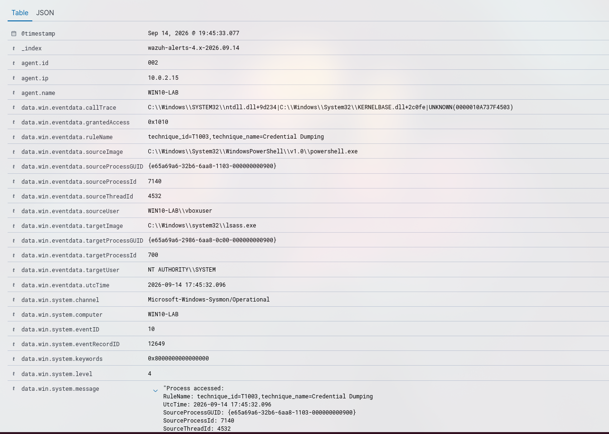

# Incidente 006: Lsass process was accessed by powershell with read permissions, possible credential dump

## Resumen
- **Fecha/hora:** 2026-09-14 19:45 (UTC+2)
- **Regla(s) que saltó:** Lsass process was accessed by powershell with read permissions, possible credential dump (92900) y Powershell script may be executing suspicious code with CreateThread API (91810)
- **Técnica MITRE ATT&CK:** T1003.001 - LSASS Memory, T1106 - Native API
- **Endpoint afectado:** WIN10-LAB
- **Severidad:** Crítica
- **Veredicto:** Verdadero positivo

## 1. Ejecución del ataque
Se realizó un ataque de ejecución de Mimikatz para el dumpeo de LSASS y obtención de credenciales.
```
Invoke-AtomicTest T1003.001 -TestNumber 10
```

## 2. Evidencia recolectada
- Captura del evento en Wazuh

- Usuario/Proceso: vboxuser -> powershell.exe
- Línea de comando completa: 
```
"Process accessed:
RuleName: technique_id=T1003,technique_name=Credential Dumping
UtcTime: 2026-09-14 17:45:32.096
SourceProcessGUID: {e65a69a6-32b6-6aa8-1103-000000000900}
SourceProcessId: 7140
SourceThreadId: 4532
SourceImage: C:\Windows\System32\WindowsPowerShell\v1.0\powershell.exe
TargetProcessGUID: {e65a69a6-2986-6aa8-0c00-000000000900}
TargetProcessId: 700
TargetImage: C:\Windows\system32\lsass.exe
GrantedAccess: 0x1010
CallTrace: C:\Windows\SYSTEM32\ntdll.dll+9d234|C:\Windows\System32\KERNELBASE.dll+2c0fe|UNKNOWN(0000010A737F4503)
SourceUser: WIN10-LAB\vboxuser
TargetUser: NT AUTHORITY\SYSTEM"
```
- Eventos correlacionados: un script de Powershell ejecutando código sospechoso con `data.win.system.eventID:4104` y `rule.id:91810`

## 3. Investigación (paso a paso)
1. Observé que un script de powershell podía estar ejecutando código malicioso con `data.win.system.eventID:4104` y `rule.id:91810`
2. Posteriormente numerosos scriptblocks con código en base64, por ejemplo: ScriptBlock ID: 607c9878-bf40-49dd-8c2d-0716d3b025cd
3. Y por último saltó una alerta avisando de que un proceso, en concreto powershell había accedido a LSASS `data.win.system.eventID:10` indicando un dumpeo de credenciales con muy alta probabilidad.
4. No hay indicios de inicio de sesión posteriores (que pudiesen indicar el uso de las credenciales robadas)
5. No hubo conexiones de red, sysmon event 3 ausente `data.win.system.eventID:3`, sin persistencia (sin 4720/7045) y sin 4624 que indique acceso remoto previo, por lo que se trata de un ataque contenido en un solo host.

## 4. Análisis
El atacante muy posiblemente realizó un dumpeo de credenciales al acceder a la memoria del proceso lsass.exe, utilizando scripts obfuscados en base64.

## 5. Acciones de respuesta
- Escalada a N2
- Aislado host de red
- Análisis forense al dispositivo
- Cuenta vboxuser deshabilitada

## 6. Recomendaciones de mejora (detection engineering)
- Activar LSA Protection para impedir que procesos abran lsass
- Activar Credential Guard para virtualizar lsass
- Implementación _Least Privilege_

## 7. Lecciones aprendidas
Aprendó lo que era LSA Protection y Credential Guard dos funciones esenciales a la hora de impedir el dumpeo de credenciales a través del proceso lsass.