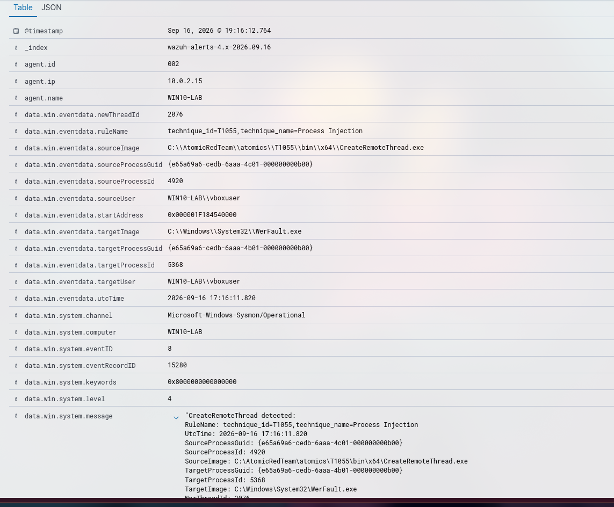

# Incident 007: Sysmon Event 8: CreateRemoteThread

## Summary
- **Date/time:** 2026-09-16 19:16 (UTC+2)
- **Triggered rule(s):** Custom rule: Sysmon Event 8: CreateRemoteThread from C:\\AtomicRedTeam\\atomics\\T1055\\bin\\x64\\CreateRemoteThread.exe to C:\\Windows\\System32\\WerFault.exe (100109)
- **MITRE ATT&CK technique:** T1055 - Process Injection
- **Affected endpoint:** WIN10-LAB
- **Severity:** High
- **Verdict:** True positive

## 1. Attack execution
A custom rule was added to Wazuh to detect Sysmon event 8 from the Windows 10 endpoint, in order to detect `CreateRemoteThread`:
```xml
<group name="windows,sysmon,">
  <rule id="100109" level="10">
    <if_group>sysmon_event8</if_group>
    <description>Sysmon Event 8: CreateRemoteThread from $(win.eventdata.sourceImage) to $(win.eventdata.targetImage)</description>
    <mitre>
      <id>T1055</id>
    </mitre>
  </rule>
</group>
```

And afterwards, a _Process Injection_ attack was performed using the _CreateRemoteThread_ WinAPI
```powershell
Invoke-AtomicTest T1055 -TestNumbers 9
```


## 2. Evidence collected
- Screenshot of the event in Wazuh

- User/Process: vboxuser → CreateRemoteThread.exe
- Full command line: `"powershell.exe" & {$process = Start-Process C:\Windows\System32\werfault.exe -passthru
C:\AtomicRedTeam\atomics\T1055\bin\x64\CreateRemoteThread.exe -pid $process.Id -debug}`
- Correlated events: Execution of `C:\AtomicRedTeam\atomics\T1055\bin\x64\CreateRemoteThread.exe` from PowerShell `rule.id:92027` and `data.win.system.eventID:1` and subsequent process injection.

## 3. Investigation (step by step)
1. I first detected the execution of a binary as administrator (`IntegrityLevel: High`) by the user `vboxuser` from PowerShell `C:\AtomicRedTeam\atomics\T1055\bin\x64\CreateRemoteThread.exe` targeting `C:\Windows\System32\werfault.exe` (`rule.id:92027` and `data.win.system.eventID:1`)
```
"Process Create:
RuleName: technique_id=T1059.001,technique_name=PowerShell
UtcTime: 2026-09-16 17:16:10.896
ProcessGuid: {e65a69a6-ceda-6aaa-4901-000000000b00}
ProcessId: 1072
Image: C:\Windows\System32\WindowsPowerShell\v1.0\powershell.exe
FileVersion: 10.0.19041.546 (WinBuild.160101.0800)
Description: Windows PowerShell
Product: Microsoft® Windows® Operating System
Company: Microsoft Corporation
OriginalFileName: PowerShell.EXE
CommandLine: "powershell.exe" & {$process = Start-Process C:\Windows\System32\werfault.exe -passthru
C:\AtomicRedTeam\atomics\T1055\bin\x64\CreateRemoteThread.exe -pid $process.Id -debug}
CurrentDirectory: C:\Users\vboxuser\AppData\Local\Temp\
User: WIN10-LAB\vboxuser
LogonGuid: {e65a69a6-ca4a-6aaa-ca93-030000000000}
LogonId: 0x393CA
TerminalSessionId: 1
IntegrityLevel: High
Hashes: SHA1=F43D9BB316E30AE1A3494AC5B0624F6BEA1BF054,MD5=04029E121A0CFA5991749937DD22A1D9,SHA256=9F914D42706FE215501044ACD85A32D58AAEF1419D404FDDFA5D3B48F66CCD9F,IMPHASH=7C955A0ABC747F57CCC4324480737EF7
ParentProcessGuid: {e65a69a6-cb53-6aaa-0501-000000000b00}
ParentProcessId: 7036
ParentImage: C:\Windows\System32\WindowsPowerShell\v1.0\powershell.exe
ParentCommandLine: "C:\Windows\System32\WindowsPowerShell\v1.0\powershell.exe" 
ParentUser: WIN10-LAB\vboxuser"
```
2. Afterwards, I detected a Sysmon event 8 detecting the creation of a CreateRemoteThread, indicating a possible process injection into `C:\Windows\System32\WerFault.exe`
```
"CreateRemoteThread detected:
RuleName: technique_id=T1055,technique_name=Process Injection
UtcTime: 2026-09-16 17:16:11.820
SourceProcessGuid: {e65a69a6-cedb-6aaa-4c01-000000000b00}
SourceProcessId: 4920
SourceImage: C:\AtomicRedTeam\atomics\T1055\bin\x64\CreateRemoteThread.exe
TargetProcessGuid: {e65a69a6-cedb-6aaa-4b01-000000000b00}
TargetProcessId: 5368
TargetImage: C:\Windows\System32\WerFault.exe
NewThreadId: 2076
StartAddress: 0x000001F184540000
StartModule: -
StartFunction: -
SourceUser: WIN10-LAB\vboxuser
TargetUser: WIN10-LAB\vboxuser"
```
3. No remote access `data.win.system.eventID:3` or newly created files `data.win.system.eventID:11` were observed
4. No process access occurred `data.win.system.eventID:10`
5. No privilege escalation `data.win.system.eventID:4732` or persistence `data.win.system.eventID:4698` was observed either
6. No authorized software that could explain this activity has been identified.

## 4. Analysis
This possibly involves _process injection_ into `WerFault.exe` since it was executed from PowerShell with administrator permissions and CreateRemoteThread comes from a path related to Atomic tests, I escalate to L2 to ask for help and continue investigating.

## 5. Response actions
- Escalation to L2
- Isolate the host from the network
- I request forensic analysis of the memory

## 6. Improvement recommendations (detection engineering)
- Create a specific alert for Sysmon event 8 since Wazuh does not normally generate a visible alert, especially an alert that prioritizes unknown source processes and sensitive targets.
- Create a precise _allowlist_ to identify legitimate tools that can use this function.


## 7. Lessons learned
I have learned what CreateRemoteThread is and what it is used for, I have also learned how to create new rules for Wazuh.
